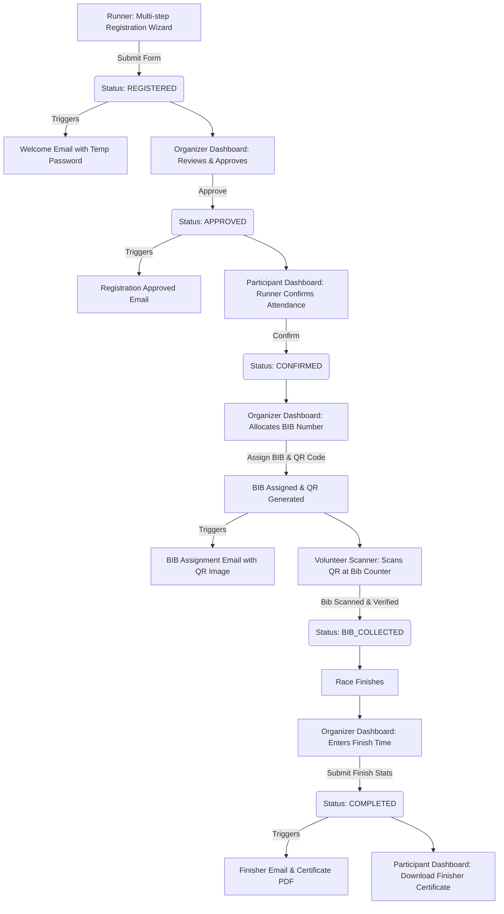
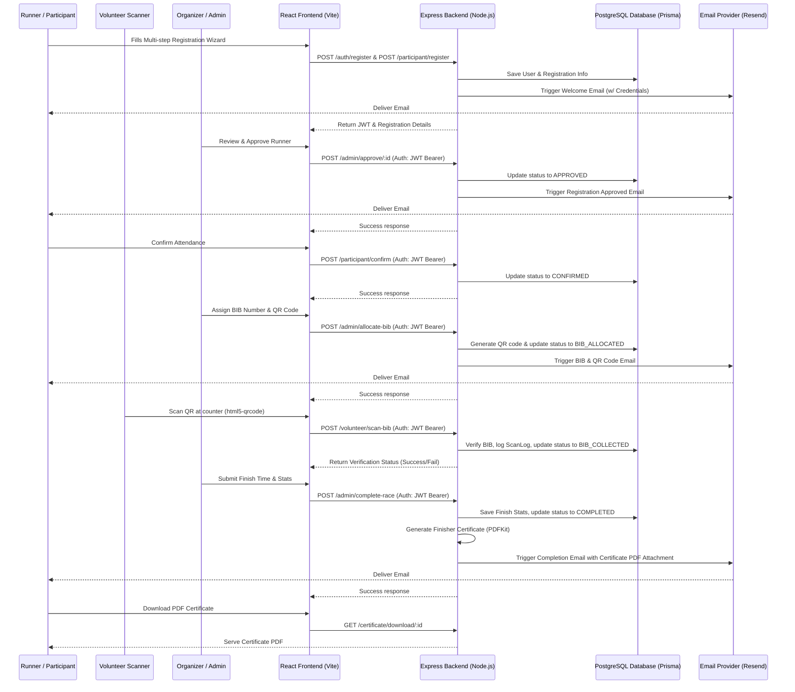

# 🏃‍♂️ Marathon Management Portal (MMP)

A modern, full-stack application designed to streamline marathon registration, runner verification, event management, and certificate generation. 

---

## 📊 Application Lifecycle Flow

Below is the runner's journey and status transition flow within the Marathon Management Portal:



---

## 🏛️ System Architecture & Connectivity

The Marathon Management Portal is built using a decoupled Client-Server architecture. The diagram below illustrates how components interact and exchange data:



---

## 🛠️ Technology Stack

### 🖥️ Frontend (Client Side)
The client application is a fast, single-page application (SPA) built with React and compiled using Vite.

*   **Core Library:** React 19 (for component-based UI)
*   **Build Tooling:** Vite 8 (for lightning-fast bundling and Hot Module Replacement)
*   **Routing:** React Router DOM (v7) (handling page transitions and role-based route protection)
*   **Styling:** Tailwind CSS (v4) (using modern utility-first classes and native `@tailwindcss/vite` plugin integrations)
*   **Form Management:** React Hook Form (handling multi-step wizard state & inputs dynamically)
*   **Validation:** Zod (performing client-side form validation schemas)
*   **HTTP Client:** Axios (interacting with REST API endpoints, using Interceptors to inject JWT authentication tokens)
*   **Data Tables:** TanStack Table (React Table v8) (for viewing, filtering, and sorting runner lists on the Admin Dashboard)
*   **Analytics & Charts:** Recharts (rendering participant registrations, distance selections, and scanning progress)
*   **Camera QR Scanning:** html5-qrcode (powering the scanner dashboard for volunteers to scan runner bibs via mobile/webcam)
*   **User Notifications:** React Toastify (displaying success, error, and status alerts)

### ⚙️ Backend (Server Side)
The backend is an asynchronous RESTful API powered by Node.js and Express.js, using Prisma ORM to interact with the database.

*   **Server Runtime:** Node.js (v18+)
*   **API Framework:** Express.js (managing routing, middleware, and request handling)
*   **Database ORM:** Prisma ORM (acting as the type-safe abstraction layer between Node.js and the database)
*   **Database:** PostgreSQL (storing all user profiles, registrations, task boards, scanned QR history, and logs)
*   **Security & Authentication:** 
    *   `jsonwebtoken` (JWT) (issuing access tokens to clients upon login)
    *   `bcryptjs` (secure one-way password hashing before DB storage)
*   **PDF Generation:** `pdfkit` (generating high-quality, customized finisher certificates dynamically with runners' names and finish times)
*   **QR Code Utilities:** `qrcode` (generating scan-ready QR code images on the fly during BIB assignment)
*   **Email Deliverability:** Resend Node.js SDK (routing system transactional emails such as welcomes, password setups, and certificates with PDF attachments)

---

## 🔗 How They Connect

The interaction between the Frontend and Backend revolves around the following design patterns:

1.  **Axios API Client & Interceptors:**
    *   The frontend establishes a base client at `src/services/api.js`.
    *   A request interceptor checks `localStorage` for `mmp_token`.
    *   If present, it appends it to the HTTP header: `Authorization: Bearer <JWT_TOKEN>`.
2.  **Cross-Origin Resource Sharing (CORS):**
    *   The backend Express server configures the `cors` middleware to allow requests only from specific frontend origins (`http://localhost:5173`) and supports credential sharing.
3.  **Role-Based Access Control (RBAC):**
    *   Users are assigned roles: `PARTICIPANT`, `ORGANIZER`, or `VOLUNTEER`.
    *   The backend validates the JWT, decodes the role, and implements strict middleware (`verifyRole`) on administrative endpoints (e.g., BIB allocation, task board management, and volunteer scans).
    *   The frontend uses role routes to lock/unlock dashboards.

---

## 📁 Repository Structure

```text
MMP/
├── Backend/                   # Node.js + Express API Backend
│   ├── prisma/                # Prisma configuration & schema.prisma
│   └── src/
│       ├── controllers/       # Controller logic (Auth, Reg, Tasks, Certificates)
│       ├── middleware/        # Authentication & Role validation middlewares
│       ├── routes/            # Express route groups
│       ├── services/          # Emailing (Resend) & PDF Generation (PDFKit)
│       └── server.js          # Express server setup & entry point
│
├── Frontend/                  # React + Vite + Tailwind Frontend
│   ├── src/
│   │   ├── components/        # Reusable UI elements (Layouts, Modals, Tables)
│   │   ├── context/           # Auth and App state contexts
│   │   ├── pages/             # Page views (Landing, Dashboards, Registration Wizard)
│   │   ├── services/          # API Axios configuration
│   │   └── index.css          # Styling & Tailwind configuration
│   └── index.html             # Single Page HTML entry point
│
└── README.md                  # Project overview & documentation (This file)
```

---

## 🚀 Setup & Execution

### 1. Backend Setup
1. Navigate to the backend directory:
   ```bash
   cd Backend
   ```
2. Install dependencies:
   ```bash
   npm install
   ```
3. Set up the `.env` file containing your `DATABASE_URL` (PostgreSQL connection string) and `RESEND_API_KEY`.
4. Generate the Prisma client and push the schema to your database:
   ```bash
   npx prisma generate
   npx prisma db push
   ```
5. Run the development server:
   ```bash
   npm run dev
   ```

### 2. Frontend Setup
1. Navigate to the frontend directory:
   ```bash
   cd ../Frontend
   ```
2. Install dependencies:
   ```bash
   npm install
   ```
3. Run the Vite development server:
   ```bash
   npm run dev
   ```
4. Access the web app at `http://localhost:5173`.
# MMP

# MMP

